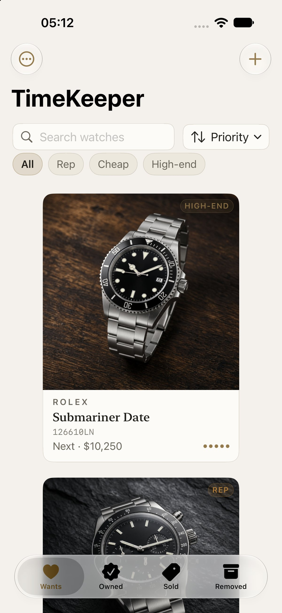
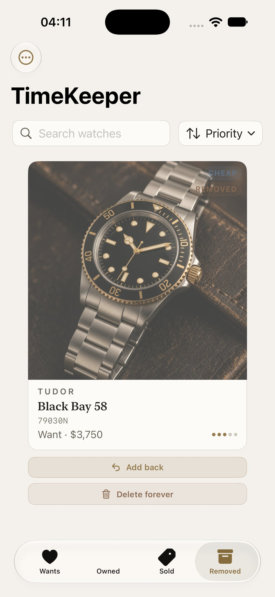
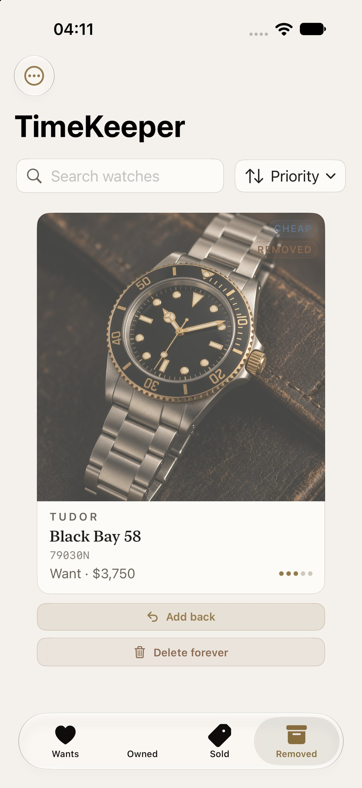

# TimeKeeper

native SwiftUI watch tracker for Mac and iPhone.

wishlist it. own it. flip it. keep the receipts.

built for people who actually care about the piece, not another notes app cosplay.

<p align="center">
  
</p>

## what it does

- **wants / owned / sold / removed** tabs that match how collectors think
- **tiers:** Rep, Cheap, High-end (filterable, searchable)
- **photo first cards** with editorial UI and brass accents
- **soft remove** then restore, or delete forever from Removed (confirm gated)
- **money fields:** target, paid, sold
- **JSON backup** export and import
- **fully native** SwiftUI + SwiftData. zero Electron energy

## screenshots

| collection | detail | removed |
|:---:|:---:|:---:|
|  |  |  |

## stack

| | |
|--|--|
| UI | SwiftUI |
| data | SwiftData |
| photos | PhotosPicker + on disk store |
| platforms | macOS + iOS |
| bundle | `app.timekeeper` |

## run it

needs Xcode (16+ is fine) and an Apple ID for Simulator.

```bash
open TimeKeeper.xcodeproj
```

pick **TimeKeeper** → **My Mac** or an **iPhone Simulator** → hit Run.

layout if youre poking around:

```
TimeKeeper.xcodeproj
TimeKeeperApp/
  Sources/TimeKeeperApp/    # views
  Sources/TimeKeeperCore/   # models + persistence
  Resources/                # assets + seed photos
docs/screenshots/
```

## status

| | |
|--|--|
| Mac + iOS Simulator Debug | shipping |
| CRUD, search, prices, JSON round trip | verified |
| soft remove / restore / hard delete | shipping |
| CloudKit / iCloud | parked |
| TestFlight / App Store | parked |

## license

MIT. see [LICENSE](LICENSE).

built by [@j1steeez](https://github.com/j1steeez)
